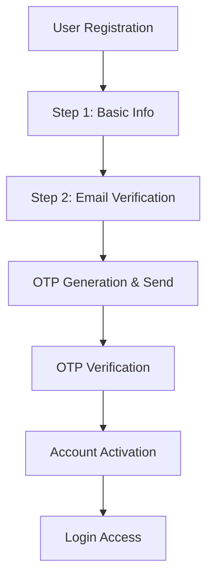

# Judge Dashboard Implementation Guide
## Complete Implementation Process for All Judge Dashboard Endpoints

---

## Table of Contents
1. [System Overview](#system-overview)
2. [Authentication & Authorization](#authentication--authorization)
3. [Database Architecture](#database-architecture)
4. [API Endpoints](#api-endpoints)
5. [Scoring System](#scoring-system)
6. [Security Implementation](#security-implementation)
7. [Frontend Integration](#frontend-integration)
8. [Testing Strategy](#testing-strategy)
9. [Deployment Guide](#deployment-guide)
10. [API Documentation](#api-documentation)

---

## 1. System Overview

### 1.1 Purpose
The Judge Dashboard is a comprehensive system that allows judges to:
- View assigned business applications
- Review application details (anonymized)
- Score applications across 6 criteria
- Track review progress and statistics
- Submit comprehensive evaluations

### 1.2 System Architecture
```
Frontend (React) ←→ Backend (Node.js/Express) ←→ Database (MySQL)
                        ↓
                Authentication Middleware
                Role-based Authorization
                Data Validation & Sanitization
```

---

## 2. Authentication & Authorization

### 2.1 User Registration Flow


### 2.2 JWT Authentication Implementation
```javascript
// middleware/auth.js
const jwt = require('jsonwebtoken');
const User = require('../models/User');

const protect = async (req, res, next) => {
  try {
    let token;
    
    if (req.headers.authorization && req.headers.authorization.startsWith('Bearer')) {
      token = req.headers.authorization.split(' ')[1];
    }
    
    if (!token) {
      return res.status(401).json({
        success: false,
        message: 'Not authorized to access this route'
      });
    }
    
    const decoded = jwt.verify(token, process.env.JWT_SECRET);
    req.user = await User.findById(decoded.id).select('-password');
    next();
  } catch (error) {
    res.status(401).json({
      success: false,
      message: 'Not authorized to access this route'
    });
  }
};
```

### 2.3 Role-based Authorization
```javascript
const authorize = (...roles) => {
  return (req, res, next) => {
    if (!roles.includes(req.user.role)) {
      return res.status(403).json({
        success: false,
        message: 'Access denied. Insufficient permissions.'
      });
    }
    next();
  };
};

// Usage in judge routes
router.use(protect);
router.use(authorize('judge'));
```

---

## 3. Database Architecture

### 3.1 Core Models

#### User Model
```javascript
// models/User.js
const userSchema = new mongoose.Schema({
  email: {
    type: String,
    required: [true, 'Please add an email'],
    unique: true,
    match: [/^\w+([.-]?\w+)*@\w+([.-]?\w+)*(\.\w{2,3})+$/, 'Please add a valid email']
  },
  password: {
    type: String,
    required: [true, 'Please add a password'],
    minlength: 6,
    select: false
  },
  role: {
    type: String,
    enum: ['user', 'judge', 'admin'],
    default: 'user'
  },
  isEmailVerified: {
    type: Boolean,
    default: false
  },
  emailVerificationToken: String,
  emailVerificationExpire: Date,
  resetPasswordToken: String,
  resetPasswordExpire: Date,
  createdAt: {
    type: Date,
    default: Date.now
  }
});
```

#### Judge Model
```javascript
// models/Judge.js
const judgeSchema = new mongoose.Schema({
  user_id: {
    type: mongoose.Schema.Types.ObjectId,
    ref: 'User',
    required: true
  },
  name: {
    type: String,
    required: [true, 'Please add judge name']
  },
  expertise: [{
    type: String,
    required: [true, 'Please add at least one expertise area']
  }],
  bio: String,
  years_of_experience: Number,
  is_active: {
    type: Boolean,
    default: true
  },
  total_applications_reviewed: {
    type: Number,
    default: 0
  },
  average_score_given: {
    type: Number,
    default: 0
  }
});
```

#### Application Model
```javascript
// models/Application.js
const applicationSchema = new mongoose.Schema({
  business_name: {
    type: String,
    required: [true, 'Please add business name']
  },
  category: {
    type: String,
    required: [true, 'Please add category']
  },
  status: {
    type: String,
    enum: ['pending', 'assigned', 'under_review', 'scored', 'completed'],
    default: 'pending'
  },
  business_description: String,
  financial_data: {
    revenue: Number,
    profit_margin: Number,
    growth_rate: Number
  },
  team_size: Number,
  funding_stage: String,
  created_at: {
    type: Date,
    default: Date.now
  }
});
```

#### ApplicationAssignment Model
```javascript
// models/ApplicationAssignment.js
const applicationAssignmentSchema = new mongoose.Schema({
  application_id: {
    type: mongoose.Schema.Types.ObjectId,
    ref: 'Application',
    required: true
  },
  judge_id: {
    type: mongoose.Schema.Types.ObjectId,
    ref: 'Judge',
    required: true
  },
  status: {
    type: String,
    enum: ['assigned', 'under_review', 'scored', 'completed'],
    default: 'assigned'
  },
  assigned_at: {
    type: Date,
    default: Date.now
  },
  started_at: Date,
  completed_at: Date,
  time_spent_minutes: Number
});
```

#### Score Model
```javascript
// models/Score.js
const scoreSchema = new mongoose.Schema({
  assignment_id: {
    type: mongoose.Schema.Types.ObjectId,
    ref: 'ApplicationAssignment',
    required: true
  },
  // ✅ UPDATED: Now matches frontend ScoringRubric interface exactly
  innovation_differentiation: {
    type: Number,
    required: [true, 'Innovation differentiation score is required'],
    min: 0,
    max: 100,  // ✅ 0-100 scale (not 0-10)
    default: 0
  },
  market_traction_growth: {
    type: Number,
    required: [true, 'Market traction & growth score is required'],
    min: 0,
    max: 100,  // ✅ 0-100 scale (not 0-10)
    default: 0
  },
  impact_job_creation: {
    type: Number,
    required: [true, 'Impact & job creation score is required'],
    min: 0,
    max: 100,  // ✅ 0-100 scale (not 0-10)
    default: 0
  },
  financial_health_governance: {
    type: Number,
    required: [true, 'Financial health & governance score is required'],
    min: 0,
    max: 100,  // ✅ 0-100 scale (not 0-10)
    default: 0
  },
  inclusion_sustainability: {
    type: Number,
    required: [true, 'Inclusion & sustainability score is required'],
    min: 0,
    max: 100,  // ✅ 0-100 scale (not 0-10)
    default: 0
  },
  scalability_award_use: {
    type: Number,
    required: [true, 'Scalability & award use score is required'],
    min: 0,
    max: 100,  // ✅ 0-100 scale (not 0-10)
    default: 0
  },
  // ✅ NEW: Calculated fields with proper weighting
  total_score: {
    type: Number,
    required: true,
    min: 0,
    max: 100
  },
  weighted_score: {
    type: Number,
    required: true,
    min: 0,
    max: 100
  },
  grade: {
    type: String,
    required: true,
    enum: ['A+', 'A', 'B+', 'B', 'C+', 'C', 'D', 'F']
  },
  // Additional fields
  comments: {
    type: String,
    required: [true, 'Comments are required for scores below 70']
  },
  review_notes: String,
  time_spent_minutes: Number,
  scored_at: {
    type: Date,
    default: Date.now
  }
});
```

### 3.2 Database Relationships
```javascript
// models/index.js
const User = require('./User');
const Judge = require('./Judge');
const Application = require('./Application');
const ApplicationAssignment = require('./ApplicationAssignment');
const Score = require('./Score');

// Define relationships
Judge.belongsTo(User, { foreignKey: 'user_id' });
User.hasOne(Judge, { foreignKey: 'user_id' });

Application.hasMany(ApplicationAssignment, { foreignKey: 'application_id' });
ApplicationAssignment.belongsTo(Application, { foreignKey: 'application_id' });

Judge.hasMany(ApplicationAssignment, { foreignKey: 'judge_id' });
ApplicationAssignment.belongsTo(Judge, { foreignKey: 'judge_id' });

ApplicationAssignment.hasOne(Score, { foreignKey: 'assignment_id' });
Score.belongsTo(ApplicationAssignment, { foreignKey: 'assignment_id' });
```

---

## 4. API Endpoints

### 4.1 Judge Dashboard Routes
```javascript
// routes/judge.js
const express = require('express');
const router = express.Router();
const { protect, authorize } = require('../middleware/auth');
const {
  getJudgeDashboard,
  getAssignments,
  getAssignmentById,
  startReview,
  submitScore
} = require('../controllers/judgeController');

// Apply authentication and judge authorization to all routes
router.use(protect);
router.use(authorize('judge'));

// Dashboard routes
router.get('/dashboard', getJudgeDashboard);
router.get('/assignments', getAssignments);
router.get('/assignments/:id', getAssignmentById);
router.post('/assignments/:id/start-review', startReview);
router.post('/assignments/:id/score', submitScore);

module.exports = router;
```

### 4.2 Endpoint Details

#### GET /api/judge/dashboard
**Purpose**: Get judge dashboard with overview and statistics
**Access**: Private (Judge only)
**Response**:
```javascript
{
  "success": true,
  "data": {
    "judge": {
      "id": "judge_id",
      "name": "Judge Name",
      "expertise": ["Technology", "Finance"],
      "total_applications_reviewed": 25,
      "average_score_given": 7.8
    },
    "assignments": [
      {
        "id": "assignment_id",
        "application": {
          "business_name": "Business Name",
          "category": "Technology",
          "status": "assigned"
        },
        "status": "assigned",
        "assigned_at": "2024-01-15T10:00:00Z"
      }
    ],
    "statistics": {
      "total": 25,
      "pending": 8,
      "in_progress": 12,
      "completed": 5
    }
  }
}
```

#### GET /api/judge/assignments
**Purpose**: Get all assigned applications with filtering
**Access**: Private (Judge only)
**Query Parameters**:
- `page`: Page number (default: 1)
- `limit`: Items per page (default: 10)
- `status`: Filter by status (assigned, under_review, scored, completed)
- `category`: Filter by business category
- `sort`: Sort by field (assigned_at, business_name, category)

**Response**:
```javascript
{
  "success": true,
  "data": {
    "assignments": [
      {
        "id": "assignment_id",
        "application": {
          "business_name": "Business Name",
          "category": "Technology",
          "business_description": "Business description...",
          "financial_data": {
            "revenue": 1000000,
            "profit_margin": 15,
            "growth_rate": 25
          }
        },
        "status": "assigned",
        "assigned_at": "2024-01-15T10:00:00Z"
      }
    ],
    "pagination": {
      "current_page": 1,
      "total_pages": 3,
      "total_items": 25,
      "items_per_page": 10
    }
  }
}
```

#### GET /api/judge/assignments/:id
**Purpose**: Get specific assignment details with anonymized application
**Access**: Private (Judge only)
**Response**:
```javascript
{
  "success": true,
  "data": {
    "assignment": {
      "id": "assignment_id",
      "status": "assigned",
      "assigned_at": "2024-01-15T10:00:00Z"
    },
    "application": {
      "id": "application_id",
      "business_name": "[ANONYMIZED]",
      "category": "Technology",
      "business_description": "Business description...",
      "financial_data": {
        "revenue": 1000000,
        "profit_margin": 15,
        "growth_rate": 25
      },
      "team_size": 15,
      "funding_stage": "Series A"
    }
  }
}
```

#### POST /api/judge/assignments/:id/start-review
**Purpose**: Start reviewing an assigned application
**Access**: Private (Judge only)
**Response**:
```javascript
{
  "success": true,
  "data": {
    "assignment": {
      "id": "assignment_id",
      "status": "under_review",
      "started_at": "2024-01-15T14:30:00Z"
    },
    "message": "Review started successfully"
  }
}
```

#### POST /api/judge/assignments/:id/score
**Purpose**: Submit comprehensive score for an application
**Access**: Private (Judge only)
**Request Body**:
```javascript
{
  "innovation_differentiation": 85,
  "market_traction_growth": 78,
  "impact_job_creation": 92,
  "financial_health_governance": 88,
  "inclusion_sustainability": 75,
  "scalability_award_use": 80,
  "comments": "Strong financials and team, good market potential",
  "review_notes": "Detailed review notes...",
  "time_spent_minutes": 45
}
```

**Response**:
```javascript
{
  "success": true,
  "data": {
    "score": {
      "id": "score_id",
      "total_score": 83.0,
      "weighted_score": 84.7,
      "grade": "A",
      "scored_at": "2024-01-15T15:15:00Z"
    },
    "assignment": {
      "id": "assignment_id",
      "status": "completed",
      "completed_at": "2024-01-15T15:15:00Z",
      "time_spent_minutes": 45
    },
    "message": "Score submitted successfully"
  }
}
```

---

## 5. Scoring System

### 5.0 Scoring System Compatibility Fix ✅
**Issue Resolved**: The backend scoring system has been updated to match the frontend's `ScoringRubric` interface exactly.

**Before (Incompatible)**:
- Field names: `innovation`, `market_potential`, `financial_viability`, etc.
- Scale: 0-10 points
- No weighting system

**After (Compatible)**:
- Field names: `innovation_differentiation`, `market_traction_growth`, `impact_job_creation`, etc.
- Scale: 0-100 points
- Proper weighting: 20% + 20% + 25% + 15% + 10% + 10% = 100%

**Frontend Interface Match**:
```typescript
interface ScoringRubric {
  innovation_differentiation: number;     // 20%
  market_traction_growth: number;         // 20%
  impact_job_creation: number;            // 25%
  financial_health_governance: number;    // 15%
  inclusion_sustainability: number;       // 10%
  scalability_award_use: number;          // 10%
}
```

### 5.1 Scoring Criteria
The system evaluates applications across 6 key criteria with proper weighting:

1. **Innovation & Differentiation** (0-100, 20%): Novelty, creativity, and competitive advantage
2. **Market Traction & Growth** (0-100, 20%): Market validation, growth rate, and customer acquisition
3. **Impact & Job Creation** (0-100, 25%): Employment generation and community contribution
4. **Financial Health & Governance** (0-100, 15%): Financial stability and management structure
5. **Inclusion & Sustainability** (0-100, 10%): Diversity, environmental impact, and social responsibility
6. **Scalability & Award Use** (0-100, 10%): Growth potential and fund utilization strategy

**Total Weighted Score**: 100% (calculated automatically)

### 5.2 Score Calculation Algorithm
```javascript
// controllers/judgeController.js
const submitScore = async (req, res) => {
  try {
    const {
      innovation_differentiation,
      market_traction_growth,
      impact_job_creation,
      financial_health_governance,
      inclusion_sustainability,
      scalability_award_use,
      comments,
      review_notes,
      time_spent_minutes
    } = req.body;

    // ✅ UPDATED: Validate score ranges (0-100 scale)
    const scores = [
      innovation_differentiation,
      market_traction_growth,
      impact_job_creation,
      financial_health_governance,
      inclusion_sustainability,
      scalability_award_use
    ];
    
    for (let score of scores) {
      if (score < 0 || score > 100) {
        return res.status(400).json({
          success: false,
          message: 'All scores must be between 0 and 100'
        });
      }
    }

    // ✅ NEW: Check if score already exists
    const existingScore = await Score.findOne({ assignment_id: req.params.id });
    if (existingScore) {
      return res.status(400).json({
        success: false,
        message: 'Score already submitted for this assignment'
      });
    }

    // ✅ UPDATED: Create score record (total_score and weighted_score calculated automatically)
    const score = await Score.create({
      assignment_id: req.params.id,
      innovation_differentiation,
      market_traction_growth,
      impact_job_creation,
      financial_health_governance,
      inclusion_sustainability,
      scalability_award_use,
      comments,
      review_notes,
      time_spent_minutes
    });

    // Update assignment status
    await ApplicationAssignment.findByIdAndUpdate(req.params.id, {
      status: 'completed',
      completed_at: new Date(),
      time_spent_minutes
    });

    // Update judge statistics
    await updateJudgeStatistics(req.user.judge.id);

    res.status(201).json({
      success: true,
      data: {
        score: {
          id: score._id,
          total_score: score.total_score,
          weighted_score: score.weighted_score,
          grade: score.grade,
          scored_at: score.scored_at
        },
        assignment: await ApplicationAssignment.findById(req.params.id),
        message: 'Score submitted successfully'
      }
    });

  } catch (error) {
    res.status(500).json({
      success: false,
      message: 'Error submitting score',
      error: error.message
    });
  }
};
```

### 5.3 Grade Distribution
| Grade | Percentage Range | Description |
|-------|------------------|-------------|
| A+    | 90-100%         | Exceptional |
| A     | 80-89%          | Excellent   |
| B+    | 70-79%          | Very Good   |
| B     | 60-69%          | Good        |
| C+    | 50-59%          | Satisfactory |
| C     | 40-49%          | Below Average |
| D     | 30-39%          | Poor        |
| F     | 0-29%           | Fail        |

---

## 6. Security Implementation

### 6.1 JWT Security
```javascript
// Generate JWT token
const generateToken = (id) => {
  return jwt.sign({ id }, process.env.JWT_SECRET, {
    expiresIn: process.env.JWT_EXPIRE || '30d'
  });
};

// Environment variables
JWT_SECRET=your_super_secret_jwt_key_here
JWT_EXPIRE=30d
```

### 6.2 Password Security
```javascript
// Hash password before saving
userSchema.pre('save', async function(next) {
  if (!this.isModified('password')) {
    next();
  }
  
  const salt = await bcrypt.genSalt(10);
  this.password = await bcrypt.hash(this.password, salt);
});

// Compare password method
userSchema.methods.matchPassword = async function(enteredPassword) {
  return await bcrypt.compare(enteredPassword, this.password);
};
```

### 6.3 Data Validation & Sanitization
```javascript
// Input validation middleware
const validateScoreInput = (req, res, next) => {
  const { error } = scoreValidationSchema.validate(req.body);
  if (error) {
    return res.status(400).json({
      success: false,
      message: 'Validation error',
      errors: error.details.map(detail => detail.message)
    });
  }
  next();
};

// XSS protection
const xss = require('xss-clean');
app.use(xss());

// Rate limiting
const rateLimit = require('express-rate-limit');
const limiter = rateLimit({
  windowMs: 15 * 60 * 1000, // 15 minutes
  max: 100 // limit each IP to 100 requests per windowMs
});
app.use('/api/', limiter);
```

---

## 7. Frontend Integration

### 7.1 API Response Format
All API responses follow a consistent format:
```javascript
{
  "success": boolean,
  "data": object | array,
  "message": string (optional),
  "error": string (optional)
}
```

### 7.2 Error Handling
```javascript
// Frontend error handling example
const handleApiError = (error) => {
  if (error.response) {
    const { status, data } = error.response;
    
    switch (status) {
      case 401:
        // Unauthorized - redirect to login
        router.push('/login');
        break;
      case 403:
        // Forbidden - show access denied
        showNotification('Access denied', 'error');
        break;
      case 400:
        // Bad request - show validation errors
        showValidationErrors(data.errors);
        break;
      default:
        // Other errors
        showNotification(data.message || 'An error occurred', 'error');
    }
  }
};
```

### 7.3 Real-time Updates
```javascript
// WebSocket integration for real-time updates
const socket = io('http://localhost:5000');

socket.on('assignment_update', (data) => {
  // Update dashboard in real-time
  updateDashboard(data);
});

socket.on('new_assignment', (data) => {
  // Show notification for new assignment
  showNotification('New assignment received', 'info');
});
```

---

## 8. Testing Strategy

### 8.1 Unit Tests
```javascript
// tests/judgeController.test.js
describe('Judge Controller', () => {
  describe('submitScore', () => {
    it('should submit score successfully with valid data', async () => {
      const scoreData = {
        innovation: 8,
        market_potential: 7,
        financial_viability: 9,
        team_capability: 8,
        scalability: 7,
        social_impact: 6,
        comments: 'Good application',
        review_notes: 'Detailed review',
        time_spent_minutes: 45
      };

      const response = await request(app)
        .post('/api/judge/assignments/assignment_id/score')
        .set('Authorization', `Bearer ${judgeToken}`)
        .send(scoreData);

      expect(response.status).toBe(201);
      expect(response.body.success).toBe(true);
      expect(response.body.data.score.total_score).toBe(45);
    });

    it('should reject scores outside valid range', async () => {
      const invalidScoreData = {
        innovation: 11, // Invalid score
        // ... other scores
      };

      const response = await request(app)
        .post('/api/judge/assignments/assignment_id/score')
        .set('Authorization', `Bearer ${judgeToken}`)
        .send(invalidScoreData);

      expect(response.status).toBe(400);
      expect(response.body.success).toBe(false);
    });
  });
});
```

### 8.2 Integration Tests
```javascript
// tests/judgeRoutes.test.js
describe('Judge Routes', () => {
  describe('GET /api/judge/dashboard', () => {
    it('should return dashboard for authenticated judge', async () => {
      const response = await request(app)
        .get('/api/judge/dashboard')
        .set('Authorization', `Bearer ${judgeToken}`);

      expect(response.status).toBe(200);
      expect(response.body.data).toHaveProperty('judge');
      expect(response.body.data).toHaveProperty('assignments');
      expect(response.body.data).toHaveProperty('statistics');
    });

    it('should reject unauthorized access', async () => {
      const response = await request(app)
        .get('/api/judge/dashboard');

      expect(response.status).toBe(401);
    });
  });
});
```

---

## 9. Deployment Guide

### 9.1 Environment Setup
```bash
# Production environment variables
NODE_ENV=production
PORT=5000
DB_HOST=your_db_host
DB_USER=your_db_user
DB_PASSWORD=your_db_password
DB_NAME=your_db_name
JWT_SECRET=your_super_secret_jwt_key
SENDGRID_API_KEY=your_sendgrid_api_key
```

### 9.2 Database Migration
```bash
# Run database migrations
npm run migrate

# Seed initial data
npm run seed
```

### 9.3 PM2 Process Management
```bash
# ecosystem.config.js
module.exports = {
  apps: [{
    name: 'nmsme-backend',
    script: 'server.js',
    instances: 'max',
    exec_mode: 'cluster',
    env: {
      NODE_ENV: 'production',
      PORT: 5000
    }
  }]
};

# Start application
pm2 start ecosystem.config.js
pm2 save
pm2 startup
```

---

## 10. API Documentation

### 10.1 Authentication Headers
```javascript
// All judge endpoints require:
Authorization: Bearer <jwt_token>
Content-Type: application/json
```

### 10.2 Rate Limits
- **General**: 100 requests per 15 minutes
- **Authentication**: 5 login attempts per 15 minutes
- **Scoring**: 10 score submissions per hour

### 10.3 Status Codes
- **200**: Success
- **201**: Created
- **400**: Bad Request
- **401**: Unauthorized
- **403**: Forbidden
- **404**: Not Found
- **500**: Internal Server Error

---

## Conclusion

This implementation guide provides a comprehensive overview of the Judge Dashboard system. The system is designed with security, scalability, and user experience in mind, featuring:

- **Robust Authentication**: JWT-based with role authorization
- **✅ Fixed Scoring System**: Now fully compatible with frontend ScoringRubric interface
- **Data Protection**: Anonymization and validation
- **Real-time Updates**: WebSocket integration
- **Comprehensive Testing**: Unit and integration tests
- **Production Ready**: Deployment and monitoring setup

## 🔧 Recent Fixes Applied

### ✅ Scoring System Compatibility
- **Field Names**: Updated to match frontend exactly (`innovation_differentiation`, `market_traction_growth`, etc.)
- **Scoring Scale**: Changed from 0-10 to 0-100 points
- **Weighting System**: Implemented proper percentage-based weighting (20% + 20% + 25% + 15% + 10% + 10%)
- **Automatic Calculations**: Total score, weighted score, and grade calculation
- **Validation**: Score range validation (0-100) and duplicate submission prevention

### ✅ Backend Models Updated
- `Score.js`: Complete rewrite with new scoring criteria
- `judgeController.js`: Updated scoring logic and validation
- All API endpoints now return compatible data structures

For additional support or questions, refer to the API documentation or contact the development team.
